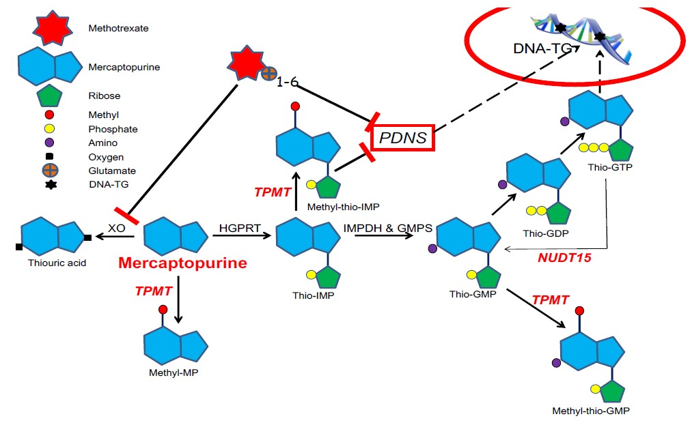

<p align="center"></p>

This repository contains the MAIDS description for project U21-01. It was built by cloning the [MAIDS-Template](https://github.com/PERSIMUNE/MAIDS-Template). You will find more details about this dataset below with links to visit the website and download the PDF.

>MAIDS is currently being prototyped for the [Copenhagen Ultrathon on Precision Medicine](https://ultrathon.online) where you will find more information about the event. You may also be interested in viewing other examples listed in the 2021 Ultrathon [Project Pool](https://github.com/UltrathonOnline/U21-PROJECT-POOL).

There are several ways to stay informed:
* Visit the Ultrathon's [landing page](https://ultrathon.online) and sign up to the mailing list.
* Follow us on [Twitter](https://twitter.com/UltrathonOnline).
* Watch the repository for changes.

---

### **&#10149; U21-05**
#### **Thiopurine/methotrexate maintenance therapy of acute lymphoblastic leukemia**
<p align="center"></p>

>Visit the [website](https://ultrathononline.github.io/MAIDS.U21-05.ALL/) for this dataset or download the formatted [PDF](./docs/maids.pdf).
```
Rikke Linnemann Nielsen, Kjeld Schmiegelow, Kathrine Grell
@: Rigshospitalet, Copenhagen, Denmark

To provide a deeper understanding of pharmacogenetics/-kinetics/-dynamics of MT and increase cure rates for
childhood leukemia. The datasets emerge from two Nordic childhood leukemia protocols (ALL92: 1992-2006) and
ALL2008 (2008-2018).
```